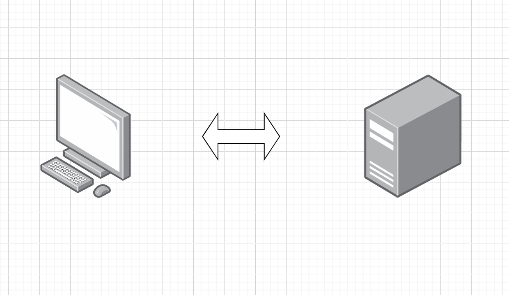
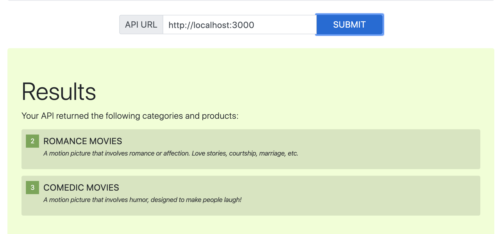

# lab-06
## Code 401 Lab 06 HTTP and REST - simple server API

### Author: Sue Duclos

### Links and Resources

- [Submission PR](https://github.com/sueduclos-401-advanced-javascript/lab-06/pull/1)
- [Swagger API](https://app.swaggerhub.com/apis-docs/sueduclos/lab-06API/0.1)

### Setup

#### How to start and run server

- `npm i -g json-server`
- `json-server --watch ./data/db.json`

#### UML

#### React Application

#### Testing
Not required for Lab 06
